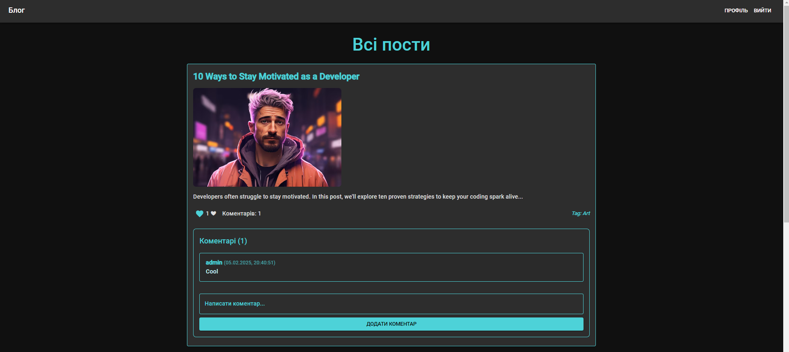
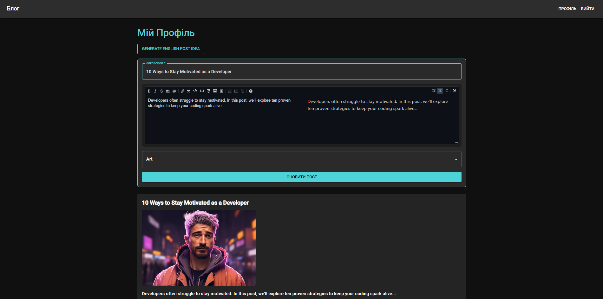

### 🚀 **Blog-React: A Simple Yet Cool Blogging App**  📝🎨

Hey there! 👋 Welcome to my **Blog-React** project! 🏗️  
This is a **super basic** blog where users can **write posts, add pictures, like posts, and comment** on them.  
It's built with **React (frontend)** and **Node.js + Express (backend)**, and uses JWT authentication for **security! 🔒**

---

## 🎯 **Main Features**
✅ **User Authentication:** Register/Login with JWT 📲  
✅ **Create Posts:** Write your thoughts, add images 📷  
✅ **Like & Comment:** Engage with posts ❤️💬  
✅ **Dark Mode & Neon Styles:** Cyberpunk vibes 🕶️💡  
✅ **Random Post Idea Generator:** For creative block moments 🤯💡  
✅ **MUI for UI:** Pretty Material UI buttons & forms 🎨

---

## 📸 **Screenshots**
Here’s how it looks! (More in the `screens` folder) 📂

| 🏡 Home Page | 📝 Writing a Post |
|-------------|----------------|
|  |  |

> **Note:** UI is in **dark mode** with a smooth **neon cyan** theme

---

## ⚙️ **Tech Stack**
**Frontend:** React.js ⚛️ + Material UI 🎨  
**Backend:** Node.js 🟢 + Express.js 🚀 + JWT 🔑  
**Database:** JSON file storage 📂 (Yeah, simple, no SQL 😅)  
**State Management:** React hooks 

---

## 🏃 **Run Locally**
Wanna try it? Follow these steps! ⬇️

### 1️⃣ **Clone the repo**
```bash
git clone https://github.com/Antot-12/Blog-React.git
cd Blog-React
```

### 2️⃣ **Install dependencies**
#### 🖥️ Backend:
```bash
cd backend
```

```bash
npm install
```

```bash
npm start
```
Server will run on `http://localhost:5000/` 🚀

#### 🎨 Frontend:
```bash
cd frontend
```

```bash
npm install
```
```bash
npm start
```
App will open on `http://localhost:3000/` 🌍

---

## 🧑‍💻 **How It Works?**
### 👤 **1. Authentication**
- 🔑 Register/Login with username & password
- 🏠 Token is stored in `localStorage`
- 🔄 Auto logout when token expires

### 📝 **2. Creating a Post**
- ✍️ Write a title & content
- 📸 Upload images
- 🚀 Click "Create Post" & see it on the homepage

### ❤️ **3. Liking & Commenting**
- 👍 Click the heart to like posts
- 💬 Add comments (if logged in)

---

## 🔮 **Random Post Idea Generator**
If you're **out of ideas**, click **"Generate Idea"** in your profile! 😃  
It will **auto-fill** a random **blog topic**! ✨

Examples:  
📌 "10 Ways to Stay Motivated as a Developer"  
📌 "How Web3 is Changing the Internet"  
📌 "Best JavaScript Tricks for Clean Code"

---

## 🔥 **To-Do / Future Features**
✅ Add animations ✨  
✅ Improve UI with more custom styles 🎨  
✅ Allow editing & deleting comments ✏️
🛠️ Convert to a real database (MongoDB, Firebase) 📦  
🛠️ Add user profiles 🧑‍💼  


---
